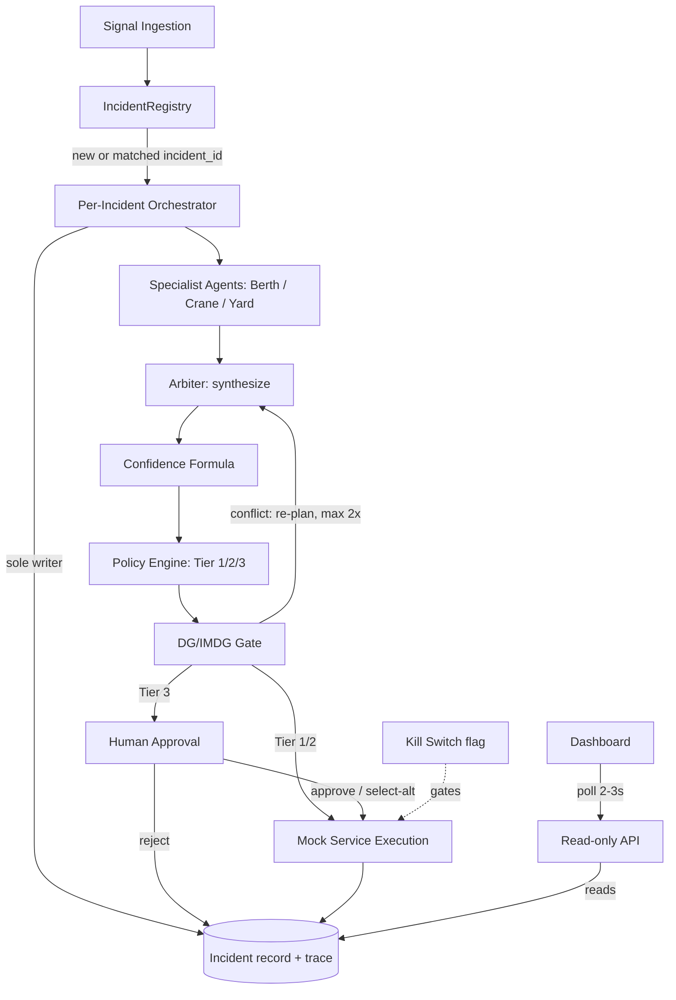
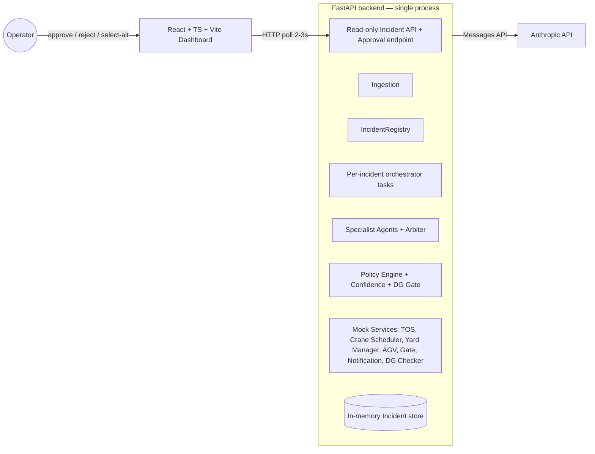

# Architecture Spine — Portwatch

## Design Paradigm

**Single-writer orchestrated pipeline, actor-per-incident.** Each incident is an isolated async task (an actor) that owns one mutable `Incident` record; work flows through fixed pipeline stages (ingest → correlate → analyze → synthesize → policy → DG-gate → approve → execute → verify), fanning out to parallel specialist-agent calls at the analysis stage and fanning back in at synthesis. No stage other than the orchestrator itself ever writes shared state — everything else is called and returns data.

**The LLM proposes, the deterministic engine disposes.** Every stage that touches policy (tier classification, DG/IMDG gating, the kill switch) is plain code with no model call in its decision path. Specialist agents and the arbiter may *recommend*; only non-LLM code *decides* what executes. This is the direct architectural answer to the "black-box AI" objection the PRD names as a judging risk — it must hold everywhere, not just where convenient.



## Invariants & Rules

### AD-1 — Single-process modular monolith

- **Binds:** all
- **Prevents:** infra/deployment complexity (queues, containers, service mesh) burning build time across a 6-day, 4-person build
- **Rule:** the backend is one deployable FastAPI process; all four build lanes (orchestration core, mock services, integration, frontend-facing API) live as modules within it, not as separate services.

### AD-2 — Agents call the Anthropic Messages API directly

- **Binds:** FR3, FR4, FR12 (specialist agents, arbiter, status-query)
- **Prevents:** an agent gaining tool/capability reach beyond its scoped role by inheriting a framework's broader autonomous-agent surface
- **Rule:** specialist agents, the arbiter, and the FR12 status-query handler are implemented as direct Messages API calls (tool-use where scoped; no tools for status-query), not via the Claude Agent SDK, Tool Runner, or Managed Agents multi-agent sessions. Each call is a bounded, single-purpose request/response — no persistent agent session, no file/bash access. Agent SDK is ruled out per AD-3 (broader autonomous surface than scoped tool access needs); Tool Runner and Managed Agents are ruled out as unneeded process/session machinery given AD-1 (single process), AD-9 (no persistence), and AD-10 (no auth/session) already remove the problems those primitives exist to solve.

### AD-3 — Per-agent tool scoping enforced at the API-call boundary

- **Binds:** FR3, Security §5 (least-privilege)
- **Prevents:** an agent calling a tool outside its role (e.g. Berth calling Yard Manager)
- **Rule:** each agent's allowed tools come from a static manifest (agent name → tool schema list); only manifest tools are ever passed into that agent's API call. Adding capability means editing the manifest, never the prompt.

### AD-4 — Single-writer orchestrator owns Incident state and trace

- **Binds:** FR1, FR14, FR15, FR16, all
- **Prevents:** concurrent incidents, or independently-built agents/mock services, racing or double-writing shared state
- **Rule:** one `Incident` record per `incident_id`, held by that incident's orchestrator task, with an embedded append-only `trace` list. Only the orchestrator coroutine writes to `Incident` or appends trace entries — read "the orchestrator writes a trace entry for every stage transition", never "every stage writes its own". Specialist agents, arbiter, policy engine, and mock services are pure call/return — they never touch shared state. The frontend/API layer only reads.
- **The orchestrator boundary, in module terms:** `backend/orchestrator/**` *and* the `agents/dispatch.py` entry points (`run_specialists`, `synthesize_options`) are the orchestrator — they may receive the `Incident`. Everything under `agents/{berth,crane,yard,arbiter}`, `policy/`, and `mock_services/` receives plain values (a rendered brief string, an option, an action dict), never the `Incident` object.
- **Registry carve-out:** the `IncidentRegistry` (AD-5) is the one other writer — it sets `entity_refs` / `last_signal_at` and appends the `CORRELATE` entry, but **only before that incident's orchestrator task is spawned**. Once the task exists, a newly-correlated signal is handed to the *running* task through a single-consumer channel (an `asyncio.Queue` the orchestrator drains at stage boundaries), never by a direct registry write and never by spawning a second task for the same `incident_id`.
- Enforced by code review and module boundaries, not by the language (Python doesn't give private references) — an accepted tradeoff at this team size and timeline.

### AD-5 — Central IncidentRegistry gates correlation

- **Binds:** FR2
- **Prevents:** duplicate/parallel incidents for what should be one correlated event; ingestion logic diverging on how correlation is decided
- **Rule:** every incoming signal is checked against an in-memory `IncidentRegistry` (keyed by `entity_refs`, format per the Consistency Conventions entity-ref grammar — prefixes `vessel|berth|crane|yard|gate`) before dispatch. No match spawns a new incident task. A match within the 15-minute rolling window is **routed into the existing incident**: the registry merges the new `entity_refs`, updates `last_signal_at`, appends one `CORRELATE` entry, and enqueues the signal on the running orchestrator's single-consumer channel (AD-4). The running orchestrator picks the merged signal up at its **next stage boundary** and folds it into the current analysis — it does not restart the pipeline and does not re-run completed stages. It never spawns a second task, and the signal is never silently dropped.

### AD-6 — Frontend reads via polling against one read-only Incident API

- **Binds:** FR12, FR15, UJ-1, UJ-2
- **Prevents:** a push-based channel (SSE/WebSocket) becoming a second, divergent way to read incident state; Person C debugging a persistent-connection layer under time pressure
- **Rule:** dashboard (incident feed, trace view, approval card, status query) all poll the same read-only Incident endpoint at a 2-3s interval. No write path from frontend to Incident except the approval action (AD-11).

### AD-7 — Kill switch: one flag, one enforcement point

- **Binds:** FR10, Security §5
- **Rule:** a single global in-memory flag, checked at exactly one point — immediately before any mock-service execution call (Tier 1/2 auto-execute, or Tier 3 post-approval). Not checked at ingestion, correlation, or analysis.
- **Prevents:** inconsistent kill-switch checks across code paths, or execution slipping through between decision and action.

### AD-8 — DG/IMDG gate has a fixed pipeline position, independent of tier

- **Binds:** FR9
- **Prevents:** a DG violation slipping through because a tier was already approved
- **Rule:** the DG/IMDG check runs after the `POLICY_DECISION` trace stage and before `EXECUTE`, for every tier. On conflict, control returns to the arbiter for a new recovery option, which is re-classified through `POLICY_DECISION` and `DG_CHECK` again — DG-gate failure is a loop-back, not a dead end. Capped at 2 re-plan attempts per incident; a third DG conflict forces Tier 3 (human escalation) regardless of the option's own tier, so the loop cannot spin indefinitely during a live demo.

### AD-9 — [ADOPTED] In-memory persistence only

- **Binds:** all
- **Prevents:** time spent on schema/migrations not needed for the golden path
- **Rule:** `Incident`, `IncidentRegistry`, and trace all live in process memory; no database. State is lost on restart — acceptable for a demo session. (Source: PRD Out-of-Scope.)

### AD-10 — [ADOPTED] No authentication

- **Binds:** all
- **Prevents:** time spent building a login/session layer the demo has no use for
- **Rule:** single-user, no login/session management; dashboard and API assume one fixed operator context. (Source: PRD Out-of-Scope.)

### AD-11 — Tier-3 "modify" is alternative-selection, not free-form edit

- **Binds:** FR11
- **Prevents:** Person C building a generic plan-diff/edit UI not needed for the demo scenario
- **Rule:** the approval-card API contract is `approve` / `reject` / `select_alternative(option_id)` against the arbiter's existing 2-3 ranked options (FR4) — never an open edit payload.

### AD-12 — [ADOPTED] Yard Manager models two terminal blocks from day 1

- **Binds:** FR17
- **Prevents:** a schema change under Day-5 time pressure
- **Rule:** the Yard Manager mock returns per-block utilization (Tuas C7, Pasir Panjang P2) from the start of the build, even though FR17's routing/recommendation logic is Day-5 stretch. (Source: PRD FR17.)

### AD-13 — Golden-path latency budget shapes the analysis stage

- **Binds:** NFR1, FR3, FR5
- **Prevents:** specialist agent calls being built sequentially by default, or the FR5 retry-once policy being implemented as an unbounded/blocking retry
- **Rule:** the ~20-30s golden-path target (ingest → policy decision) means specialist-agent calls (FR3) MUST run concurrently (`asyncio.gather`, not sequential awaits), and FR5's single retry on tool timeout/failure has a fixed short timeout (not a default client timeout) so one stalled call cannot consume the whole budget alone.

### AD-14 — A failure is always a visible trace entry, never a silent success

- **Binds:** FR13, NFR2, NFR3
- **Prevents:** a mock-service or agent-call failure being swallowed and the pipeline proceeding as if it succeeded
- **Rule:** the orchestrator writes a trace entry for every stage transition (AD-4) regardless of outcome; a failed verification, timeout, or fallback is recorded with `error`/`fallback_used` set (per the error-shape convention below), never omitted. On an unrecoverable failure the incident's confidence degrades (FR6) and the incident continues in a reduced-confidence state — it does not crash the orchestrator task.

### AD-15 — Kill-switch-blocked Tier 1/2 decisions are marked, never silently dropped

- **Binds:** FR10, AD-7, AD-4, AD-11
- **Prevents:** a Tier 1/2 incident sitting silently unresolved with no operator-visible signal while the kill switch is engaged
- **Rule:** if the kill switch is engaged at the AD-7 enforcement point and the decision was Tier 1 or 2 (would have auto-executed), the orchestrator does not execute. It appends a trace entry marked `blocked_by_kill_switch: true` (extends the AD-14 error/fallback shape) and sets a new `Incident.blocked_by_kill_switch: bool` field (default `false`). The `tier` field is never reclassified to 3 — that would corrupt FR7's tier semantics; `blocked_by_kill_switch` is the separate signal the frontend uses to render the incident as needing manual attention (EXPERIENCE.md's kill-switch-engaged state pattern). Re-enabling the kill switch does not auto-resume execution — the operator triggers re-evaluation via the existing approval endpoint's `approve` action (AD-11), which re-checks the flag and executes if now clear. No new endpoint.

### AD-16 — Per-agent demo-safety mock override (defense-in-depth beyond FR5)

- **Binds:** FR3, FR5, NFR1, NFR3
- **Prevents:** a single live-LLM hiccup (latency spike, transient API error, rate limit) during judging cascading past FR5's automatic retry/fallback into a stalled or visibly-broken golden-path run, with no way for the operator to intervene mid-demo
- **Rule:** each specialist agent call and the arbiter call reads a config-level override (one static map, e.g. `MOCK_AGENTS: {berth: bool, crane: bool, yard: bool, arbiter: bool}`, settable via env var or a single startup config value — no new UI control) that, when set for that agent, short-circuits the Messages API call and returns a canned, structurally-identical response (same shape as a real specialist/arbiter output) instead. This is a manual, pre-emptive override distinct from FR5: FR5 handles automatic in-incident recovery from a single failed call; AD-16 lets the operator take a misbehaving agent out of the live-LLM path entirely before or between demo runs, without touching correlation, policy, or execution — those stages consume the mocked output exactly as they would a real one. Source: competitive research recommendation (`research/competitive-psa-code-sprint-past-finalists-2026-08-26/research.md`, extending the PRD's existing Day-6 recorded-backup-run mitigation to per-agent granularity).
- **Honesty requirement (closed 2026-08-27, party-mode review):** a mock-forced response must never be indistinguishable from a real one in the trace or confidence — that would contradict FR6's "confidence is never an LLM self-report" and the "LLM proposes, deterministic engine disposes" invariant above. Whenever `MOCK_AGENTS` short-circuits a call, the resulting `AGENT_CALL` trace entry's `detail` includes `mock_forced: true`, and the confidence formula (FR6) applies the same -15pt missing-data penalty it uses for a fallback/cached-state field — a canned response is treated as missing real data, not as equivalent to one. `mock_forced` counts as **exactly one** missing-data unit (-15), folded into the same `fallback_fields` term — it is not a second independent penalty term; if a mocked agent *also* has a stale/cached field, both units count. The exact term and point value live in the one FR6 config module (Consistency Conventions), not as a scattered constant. The frontend surfaces this via the same plain, non-alarmist microcopy as any other trace annotation (UX-DR12), e.g. a small "response mocked for demo stability" tag — never a hidden or silent substitution.

### AD-17 — Map surface is a bundled, read-only projection of polled incident state

- Added 2026-08-28 via `sprint-change-proposal-2026-08-28.md` (Correct Course). **Binds:** FR15, UX-DR7 (revised), UX-DR13, AD-6.
- **Prevents:** a live tile/geo dependency becoming a demo failure point (cf. FR19 rationale — a live external dependency is unacceptable demo risk); the map becoming a second write path or a second source of incident truth.
- **Rule:** the map panel renders from the same `GET /incidents` poll (AD-6) — no new endpoint, no SSE. Basemap geometry (and tiles, if a raster option is ever chosen instead of the adopted d3-geo vector approach) is **vendored into the frontend bundle**; zero runtime network calls to any map or tile service. Entity → coordinate resolution is a static frontend fixture (`frontend/src/lib/geo.ts`) covering the demo-seed incidents; adding an entity means editing the fixture, never a backend change. The map is read-only and is **not** a decision surface — approve/reject/modify stays on the approval banner + incident detail (UX-DR4).

### AD-18 — "Whole orchestra" visibility surfaces are read-only projections of the polled incident record

- Added 2026-08-29. **Binds:** FR3, FR6, FR7, FR9, FR14, FR15, AD-4, AD-6, AD-16, AD-17; Person C build lane. Governed by the Harbor Signal UX companion (`ux-PSA CODE SPRINT-2026-08-29/EXPERIENCE.md` -> *The Orchestra*).
- **Prevents:** the 2026-08-29 visual pivot ("show the whole orchestra"; frontend follows `frontend/portwatch-tuas/src`) reopening the Day-3-frozen `SpecialistBundle`/arbiter contract or the golden path (cf. `sprint-change-proposal-2026-08-29.md` — zero code change); Person C requesting a bespoke `/pipeline` endpoint or a push channel for "live" stage updates; per-agent sub-state becoming a second source of incident truth outside the trace.
- **Rule:** the pipeline **stage rail**, **DG-gate state**, **policy-tier**, and **confidence** all render from the existing `GET /incidents/{incident_id}` poll (AD-6) — the `Incident` record plus its append-only `trace`. No new endpoint, no SSE, no push channel; the frontend re-skin adds no route and no write path (approval + kill-switch stay the only writes). What the current frozen backend exposes today:
  - stage rail — `trace[].stage` (SCREAMING_SNAKE vocab, `orchestrator/trace.py:STAGES`) + `error` shape for the degraded/blocked states. **Rail-state derivation** (from a completion-only, append-only trace): stage `S` is `done` iff a `stage==S` entry with no `error` exists; `degraded` iff the *latest* `stage==S` entry carries an `error`; `blocked` iff that error also carries `blocked_by_kill_switch` or a DG violation; `active` = the lowest-order stage with no entry yet; a stage that a tier legitimately skips (Tier 1/2 has no `APPROVAL`) renders `done`/`n-a`, never a permanent `pending`. After a DG re-plan the rail reflects the **last** entry per stage; the loop-back to `SYNTHESIZE` is shown from the repeated `DG_CHECK` → `POLICY_DECISION` entries (the orchestrator re-emits those; it does not re-emit `AGENT_CALL`/`SYNTHESIZE`);
  - DG-gate — `DG_CHECK` trace `detail`: `violation: bool` is **mandatory on both the live and the demo-seed path** (the demo seed MUST set it explicitly); `reason` and `rejected_option` are optional and present only on a violation. + AD-8 re-plan loop;
  - tier — `Incident.tier` and `POLICY_DECISION` `detail.tier`. **No tier-reason string is emitted** — the frontend derives the reason label deterministically from `tier` + the selected `RecoveryOption.reversible` / `dg_involved` / `predicted_impact.cost` / `.risk` + `confidence` vs the FR7 threshold. When a DG-forced Tier 3 leaves no selected option (`selected is None`, AD-8), the reason label is the fixed string **"DG/IMDG segregation — human approval required"**;
  - confidence — `Incident.confidence` int, always present. The two `CONFIDENCE` `detail` shapes are **mutually exclusive by rule**: the live path emits the structured FR6 breakdown (`staleness_seconds` / `fallback_fields` / `disagreement` / `variance_exceeds`) and **no** `reason`; the demo-seed path emits a prose `detail.reason` (str) and **none** of the structured keys. The frontend branches on `"reason" in detail`;
  - `Incident.options[].predicted_impact` — structured `{delay_min, cost, yard_impact, risk}` (FR4 seed); Notification mock already lists **MPA** (FR13).
- **The per-specialist output** the agent roster shows (each agent's `summary` / `actions` / `constraints`) is not on the current API — it needs the small read-surface addition in **AD-19**. Everything else above is a zero-backend-change projection.
- **The frozen contract stays locked:** the `SpecialistBundle` 3-tuple (`min_length=3, max_length=3`), `AgentName = Literal["berth","crane","yard"]`, the arbiter's `len(...) != 3` guard, and their frozen tests are untouched by AD-18 and AD-19 alike.

### AD-19 — Specialist bundle is exposed read-only for the agent roster

- Added 2026-08-29. **Binds:** FR3, FR14, FR15, AD-4, AD-6, AD-16, AD-18; Person A (orchestrator write), Person C (`AgentRoster` read). Governed by the Harbor Signal UX companion (*The Orchestra*).
- **Prevents:** the agent roster being unable to show the orchestra it exists to show; Person C inventing a side-channel for specialist output; Person A being asked to reopen the frozen specialist contract to satisfy a display need.
- **Rule:** after `run_specialists` returns, the orchestrator — still the sole writer (AD-4) — does two additive things:
  1. sets `Incident.agents: list[SpecialistRecommendation]` to the **validated bundle it already passes to the arbiter** (berth → crane → yard order; the same objects, not recomputed), read-only to the frontend;
  2. appends one `AGENT_CALL` trace entry per specialist — `detail: {agent, mock_forced}` (AD-16), plus the standard `{stage, error, retried, fallback_used}` shape on a timeout/fallback — so the stage rail's `AGENT_CALL` stage is real on the live path, not only in `demo_seed.py`. The stage rail collapses the 1–3 `AGENT_CALL` entries into its single `AGENT_CALL` stage (degraded if any carries an `error`); the per-agent view is the roster, driven by `Incident.agents`, not by counting trace rows.
- **Roster chip state is a 3-state derivation, not a persisted field.** `SpecialistRecommendation` carries no `state` and no per-agent `confidenceContribution` — the FR6 `disagreement` input is a single aggregate, and `run_specialists` fires `asyncio.gather` so there is no observable `QUEUED`→`RUNNING` transition to persist. Person C derives each chip: **PENDING** while that agent has no `AGENT_CALL` entry and `Incident.agents` is empty (all three chips move together the moment analysis starts — drawn side-by-side as "these ran at once", per EXPERIENCE.md); **DONE** once its `AGENT_CALL` entry exists with `error == null`; **DEGRADED** when that entry carries an `error` / `fallback_used: true` (show the reason). EXPERIENCE.md's 5-label `QUEUED → RUNNING → COMPLETE / TIMEOUT → FALLBACK` chip text collapses to these three for the build — a matching correction to that companion is a follow-up.
- **Boundary:** no new endpoint (rides `GET /incidents/{incident_id}`, AD-6); no push channel; `Incident.agents` is never written by anything but the orchestrator and never read as state by the backend. It does **not** change the roster's size or membership — `SpecialistBundle` stays exactly three, `AgentName` stays `berth|crane|yard`, the arbiter guard and every frozen specialist test are unchanged. This exposes what already exists.
- **Scope cost:** a real but small backend change — ~1 model field + ~10–15 lines where `run_specialists` is awaited + a `demo_seed.py` update to populate `Incident.agents` on the demo incidents. It **supersedes `sprint-change-proposal-2026-08-29`'s "`backend/` byte-unchanged" for this one read-surface addition**; golden-path control flow, tiers, policy, DG gate, execution, and all frozen tests stay untouched. A display-data addition alongside the frozen path, not an unfreeze of it.

## Consistency Conventions

| Concern | Convention |
| --- | --- |
| Naming (entities, files, interfaces, events) | `incident_id`: UUID4 string. Agent module names: `berth`, `crane`, `yard`, `arbiter` (lowercase). Trace entry `stage` values: `INGEST`, `CORRELATE`, `AGENT_CALL`, `SYNTHESIZE`, `CONFIDENCE`, `POLICY_DECISION`, `DG_CHECK`, `APPROVAL`, `EXECUTE`, `VERIFY` (SCREAMING_SNAKE). |
| Data & formats (ids, dates, error shapes, envelopes) | Timestamps: ISO 8601 UTC. Confidence: int 0-100. Error/failure shape: `{stage, error, retried: bool, fallback_used: bool}` (FR5). Tier: literal `1` \| `2` \| `3`. |
| JSON wire format | The API returns Pydantic `model_dump()` **verbatim — `snake_case`, no camelization**. The frontend consumes `snake_case` directly (`predicted_impact`, `blocked_by_kill_switch`, `entity_refs`, …); the camelCase field names in the UX companion's data-contract table (`tierReason`, `dgGate`, `confidenceContribution`, `predictedImpact`) are that doc's shorthand, not the wire shape. The approval action literal is `approve` \| `reject` \| `select_alternative` — **never `modify`** (that is the companion's UI verb for the same action; AD-11). `RecoveryOption.cost` and `.risk` are the literal enum `low` \| `medium` \| `high` — a magnitude to display, not free text or a currency string. |
| Entity-ref grammar | `entity_refs` tokens are `type:TOKEN` where `type ∈ {vessel, berth, crane, yard, gate}` (this is the canonical set — AD-5's "yard-block" means `yard`) and `TOKEN` matches `[A-Z0-9-]+`, upper-case canonical (`vessel:MSC-ANNA`, `yard:TUAS-C7`, `berth:C7-3`). One owner — `ingestion.make_entity_ref` — produces them; Person B's mock services and `frontend/src/lib/geo.ts` (AD-17) import or mirror that function, never hand-format. Registry correlation (AD-5) is exact-string, so a drift in case/separator silently fails to correlate — hence the single owner. (Utilization-map keys *inside* a `CORRELATE`/agent `detail` payload, e.g. `tuas_c7`, are a separate display namespace, not `entity_refs`.) |
| State & cross-cutting (mutation, errors, logging, config, auth) | Mutation only via the incident's orchestrator + the registry carve-out (AD-4). The trace list *is* the log — no separate log store for incident-level events. Tier thresholds (FR7) and confidence weights (FR6) — including whether `mock_forced` is folded into `fallback_fields` and its point value (AD-16) — live as one static config module, not scattered constants; tunable in one place per the PRD's Open Items note on Day 1-2 threshold tuning. Auth: none (AD-10). |

## Stack

| Name | Version |
| --- | --- |
| Python | 3.12+ floor (3.14 is current stable; 3.12 chosen as the broad-compat floor for LLM/async libraries, not a stale default) |
| FastAPI | ~0.141.x (verified current, released July 2026) |
| Anthropic Python SDK (Messages API, direct — not Agent SDK/Tool Runner/Managed Agents, see AD-2) | latest stable |
| Claude model | `claude-sonnet-5` for all agent calls (specialists, arbiter, FR12 status-query) — cost/latency-appropriate for AD-13's ~20-30s budget across parallel calls. Swapping the arbiter alone to a stronger model if synthesis quality needs it is a same-day tuning knob, not an architecture change. |
| React | 19.2.8 (verified current, mid-2026) |
| TypeScript | 7.x current stable (native compiler; Vite transpiles, so no `tsc` gate sits on the golden path) |
| Vite | 8.2.x (current as of Aug 2026) |

## Structural Seed

### Container view



### Shared data shapes (minimal seed — fields only, code owns the rest)

The adversarial review confirmed that with zero field-level shape, Person A (orchestrator), Person B (mock services), and Person C (frontend) would each invent incompatible names for the same concepts. These are the minimum fields that must match across lanes; anything not listed here is free for the owning lane to extend.

```text
Signal:                      # FR1 — the one normalized shape for all raw signal types; input to AD-5 correlation
  entity_refs: list[str]     # 'type:TOKEN' format (Consistency Conventions entity-ref grammar)
  signal_type: str           # recognized raw type, e.g. 'vessel_eta', 'equipment_alert', 'yard_metric', 'gate_metric', 'user_request'
  payload: dict              # original raw signal, preserved for downstream consumers
  received_at: str           # ISO 8601 UTC
# RejectedSignal: {raw: dict, reason: str, received_at: str} — a rejected raw signal is returned structured, never an exception (NFR2)

Incident:
  incident_id: str          # UUID4, set at creation (AD-5)
  status: "open" | "resolved"
  entity_refs: list[str]    # vessel/berth/crane/yard-block ids this incident correlates (FR2)
  tier: 1 | 2 | 3 | null     # null until POLICY_DECISION stage runs
  confidence: int            # 0-100 (FR6)
  recommended_option_id: str | null   # points into `options`
  options: list[RecoveryOption]       # the arbiter's 2-3 ranked outputs (FR4)
  approval_status: "n/a" | "pending" | "approved" | "rejected"
  blocked_by_kill_switch: bool   # true if a Tier 1/2 decision was blocked from executing by the kill switch (AD-15)
  agents: list[SpecialistRecommendation]   # the validated specialist bundle, read-only (AD-19); [] until AGENT_CALL runs
  trace: list[TraceEntry]    # append-only (AD-4)

SpecialistRecommendation:     # one specialist's analysis, exposed for the Harbor Signal agent roster (AD-19)
  agent: "berth" | "crane" | "yard"   # frozen roster — exactly these three, this order
  summary: str
  actions: list[str]
  constraints: list[str]      # limits/preconditions the arbiter must respect
  rationale: str

RecoveryOption:               # arbiter output, shared by Policy Engine, DG Gate, ApprovalPanel (AD-11)
  option_id: str              # stable within one incident; select_alternative(option_id) refers to this
  description: str
  predicted_impact: {delay_min: int, cost: "low"|"medium"|"high", yard_impact: str, risk: "low"|"medium"|"high"}
  reversible: bool
  dg_involved: bool

TraceEntry:
  stage: str                 # one of the SCREAMING_SNAKE values in Consistency Conventions
  timestamp: str              # ISO 8601 UTC
  detail: dict                 # stage-specific payload (agent output, policy result, etc.)
  error: {stage: str, error: str, retried: bool, fallback_used: bool} | null   # AD-14
```

### API seed (literal shapes for AD-6 / AD-11, code owns exact framework wiring)

```text
GET  /incidents                 -> list[Incident summary]
GET  /incidents/{incident_id}   -> Incident (full, incl. trace)          # polled by dashboard, AD-6
POST /incidents/{incident_id}/approval
     body: {action: "approve" | "reject" | "select_alternative", option_id?: str, note?: str}   # AD-11
                                 # `note` is accepted and recorded on the APPROVAL trace entry; optional, free text.
                                 # `action` is exactly these three literals -- the UX companion's "modify" verb maps to "select_alternative".
GET  /incidents/query?q={natural language text}&incident_id={optional}
     -> {answer: str}           # FR12, grounded by injecting current Incident state as context (AD-2).
                                 # incident_id is an OPTIONAL hint the frontend may pass when an incident
                                 # is selected (UX spine convenience) -- the backend always resolves the
                                 # relevant incident from `q` itself when omitted; never required (UJ-2:
                                 # the planner asks by vessel name without selecting anything first).
POST /kill-switch  {enabled: bool}   # AD-7
```

### Cross-lane sync conventions (Person A ↔ Person B)

- `entity_refs` values are the exact ids the ingestion layer normalizes to (e.g. `vessel:MSC-ANNA`, `berth:C7-3`) — Person B's mock services must emit/accept the same id format so registry correlation (AD-5) and mock-service calls agree on what an entity is.
- Each agent's tool manifest (AD-3) references mock-service function names directly (one manifest entry per callable mock endpoint) — when Person B adds/renames a mock function, the manifest is the one place to update; it is not duplicated elsewhere.
- **Trace `detail` key names are a Person A -> Person C contract (AD-18).** Because the Harbor Signal orchestra surfaces derive from `trace[].detail`, the keys the frontend reads are locked for the demo — Person A may add keys, never rename these: `CONFIDENCE` -> `confidence`, `staleness_seconds`, `fallback_fields`, `disagreement`, `variance_exceeds` (live path) **or** `reason` (demo-seed path); `POLICY_DECISION` -> `tier`; `DG_CHECK` -> `violation` (+ `reason` / `rejected_option` on a violation); `AGENT_CALL` -> `agent`, `mock_forced` (+ the standard `error` shape on TIMEOUT/FALLBACK) per AD-19. The frontend must tolerate a stage or key it doesn't recognise (`ExecutionTrace` already renders any stage). Beyond the AD-19 read-surface add, no backend change — this line records the shapes the code emits so the re-skin can't drift from them.

### Deployment & environments

Local dev machines for the 6-day build; a single instance (localhost or one demo box) for the live demo. No containers, no cloud infra, no multi-environment setup — this is a hackathon demo, not a shipped product. Production deployment strategy is Deferred.

### Source tree

This was the cold-start seed; the backend now exists and **owns its own layout** — the tree below is kept for orientation, with the as-built deltas noted. Code wins on any discrepancy.

```text
backend/
  ingestion/        # signal normalization (FR1)
  registry/          # IncidentRegistry (AD-5)
  orchestrator/       # run.py (per-incident task, sole state writer, AD-4), retry.py (FR5), trace.py (STAGES vocab)
  agents/             # berth.py, crane.py, yard.py, arbiter.py; base.py (frozen SpecialistBundle 3-tuple contract, AD-18/19),
                       # dispatch.py (run_specialists / synthesize_options — orchestrator boundary, AD-4), mock_override.py (AD-16),
                       # yard_load_balancing.py (AD-12) + tool manifests (AD-2, AD-3)
  policy/             # engine.py (policy tiers, FR7), confidence.py (FR6), dg_gate.py (AD-8), killswitch.py (AD-7) — pure functions
  mock_services/      # services.py — a single class-based registry (as-built), not one file per mock. Covers TOS, Crane Scheduler,
                       # Yard Manager, AGV, Gate, Notification (recipients incl. MPA, FR13), DG Checker, MpaClearanceService (FR19).
                       # One action-execution shape for all, incl. injectable timeout/failure mode (FR5).
  api/                # FastAPI routes: read-only Incident/trace endpoints, approval endpoint (AD-6, AD-11);
                       # demo_seed.py (seeded incidents) and demo_driver.py ("Three-Way Disruption" live-run trigger) are
                       # demo-only surfaces — they drive the real pipeline, they are not a second write path
  models/             # incident.py (Incident, TraceEntry), signal.py (Signal, RejectedSignal), recovery.py (RecoveryOption, PredictedImpact)
frontend/
  src/
    theme/             # Harbor Signal tokens (Space Grotesk + IBM Plex Mono, marine-ink palette,
                       # seafoam/amber/red signals, 8px radius, 214/74px rail) -- retired blueprint
                       # token set (Barlow Condensed, zero-radius, greyscale) re-skinned in place, AD-18
    routes/            # LiveConsole (default), ActiveIncidents (filters GET /incidents to unresolved),
                       # AuditTrail (session-scoped resolved list; was IncidentArchive) -- all share the
                       # one polled API, no new endpoint (per UX spine + AD-6)
    components/       # IncidentFeed, IncidentDetail (+ ConfidenceBreakdown), ApprovalBanner (decision card),
                       # StageRail, AgentRoster (new -- reads Incident.agents, AD-19), ExecutionTrace,
                       # AskPortwatch, GeoMapPanel (geographic, AD-17), KillSwitchControl
                       # -- names and visual/behavioral spec owned by the Harbor Signal UX spine
                       # (DESIGN.md/EXPERIENCE.md companions above); supersedes the 2026-08-26 blueprint set
```

## Capability → Architecture Map

| FR Group | Lives in | Governed by |
| --- | --- | --- |
| A — Signal ingestion & correlation (FR1-2) | `ingestion/`, `registry/` | AD-5 |
| B — Multi-agent analysis (FR3-4) | `agents/`, `orchestrator/` | AD-2, AD-3, AD-4, AD-19 (bundle exposed for the roster) |
| C — Uncertainty & failure handling (FR5-6) | `policy/confidence.py` | AD-4 (trace capture), AD-16 (per-agent mock override) |
| D — Policy & autonomy (FR7-10) | `policy/policy_engine.py`, `policy/dg_gate.py` | AD-7, AD-8, AD-15 |
| E — Human interaction (FR11-12) | `api/` approval + query endpoints, status-query handler | AD-2, AD-6, AD-11 |
| F — Execution & verification (FR13) | `mock_services/`, orchestrator execute stage | AD-7, AD-14 |
| G — Audit & traceability (FR14-15) | `Incident.trace`, `Incident.agents`, `api/` | AD-4, AD-14, AD-18, AD-19 |
| H — Scalability proof (FR16) | per-incident orchestrator tasks | AD-1, AD-4, AD-13 |
| I — Inter-Gateway load balancing (FR17, stretch) | `mock_services/yard_manager.py` | AD-12 |

## Deferred

- **Production deployment/infra strategy** (containers, cloud, multi-instance, HA) — not needed for a 6-day demo; revisit only if Portwatch continues past the hackathon.
- **Approval-bottleneck-at-scale handling** — PRD names this explicitly as future work (prioritize by predicted-impact/SLA-risk, batch by shared root cause); not built for the demo.
- **Real PSA system integrations** — mocked services only for this build.
- **Certified DG/legal compliance implementation** — the DG/IMDG ruleset is a simplified, representative subset for demo purposes, stated explicitly (per PRD Compliance Note) so it reads as intentional scoping.
- **Persistence beyond the demo session** and **production auth** — revisit together if Portwatch is ever productionized (AD-9, AD-10).
- **FR19 mocked MPA clearance check** — **built** (story 3-4, `MpaClearanceService` in `mock_services/`); a new mock on the existing `execute(action)` contract, no interface drift. Noted here only because it post-dates the spine's original scope line.
- **FR18 Weather Circuit-Breaker agent and FR20 AGV/Gate specialist agent** — **formally descoped 2026-08-29** via `sprint-change-proposal-2026-08-29.md`: both require unfreezing the Day-3-frozen 3-specialist `SpecialistBundle`/arbiter contract, so neither is "strictly additive", and they are the #3 / last-ranked Day-5 stretch items. Epic 3's generalization goal is met by the delivered FR16/FR17/FR19 work. The conditional-4th-specialist design is preserved in `deferred-work.md` for post-sprint; these FRs are outside this spine's `binds` (FR1-FR17) either way.
- **Micro-climate / additional mock-service event types** beyond the built roster — same `execute(action)` pattern; structurally cheap, not committed.
- **Strait-Level Collision Avoidance, Transshipment MARL/GNN Optimization** — named in the PRD as roadmap-only, explicitly not hackathon-buildable; excluded from this spine entirely.
