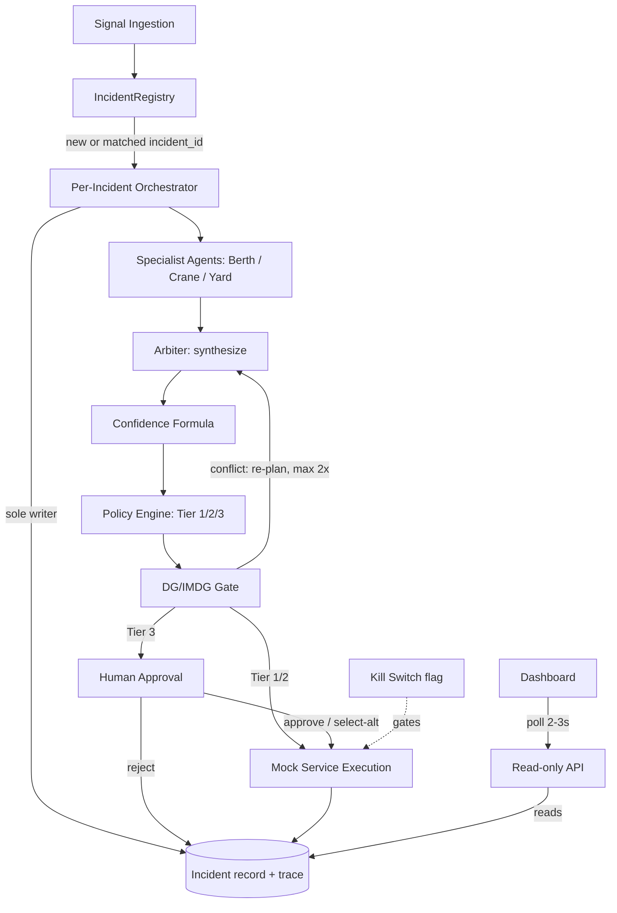
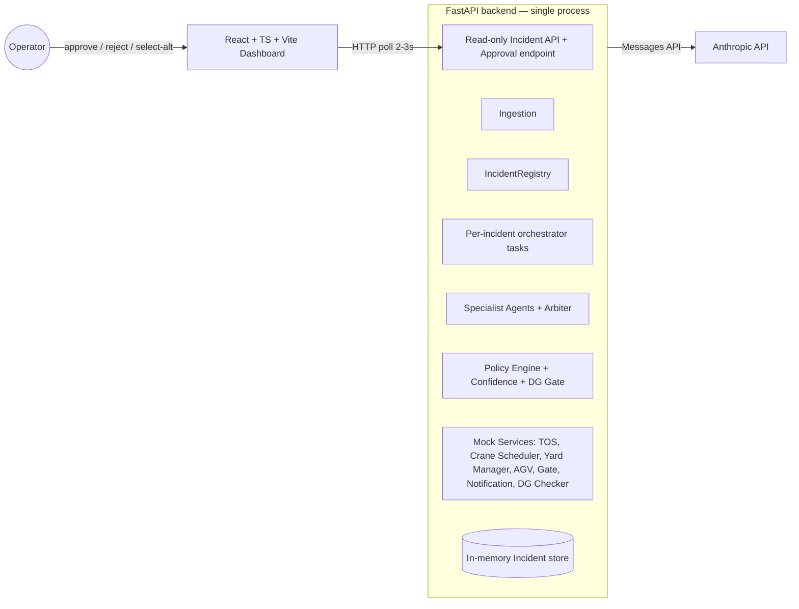

# Architecture Spine — Portwatch

## Design Paradigm

**Single-writer orchestrated pipeline, actor-per-incident.** Each incident is an isolated async task (an actor) that owns one mutable `Incident` record; work flows through fixed pipeline stages (ingest → correlate → analyze → synthesize → policy → DG-gate → approve → execute → verify), fanning out to parallel specialist-agent calls at the analysis stage and fanning back in at synthesis. No stage other than the orchestrator itself ever writes shared state — everything else is called and returns data.

**The LLM proposes, the deterministic engine disposes.** Every stage that touches policy (tier classification, DG/IMDG gating, the kill switch) is plain code with no model call in its decision path. Specialist agents and the arbiter may *recommend*; only non-LLM code *decides* what executes. This is the direct architectural answer to the "black-box AI" objection the PRD names as a judging risk — it must hold everywhere, not just where convenient.



## Invariants & Rules

### AD-1 — Single-process modular monolith

- **Binds:** all
- **Prevents:** infra/deployment complexity (queues, containers, service mesh) burning build time across a 6-day, 4-person build
- **Rule:** the backend is one deployable FastAPI process; all four build lanes (orchestration core, mock services, integration, frontend-facing API) live as modules within it, not as separate services.

### AD-2 — Agents call the Anthropic Messages API directly

- **Binds:** FR3, FR4, FR12 (specialist agents, arbiter, status-query)
- **Prevents:** an agent gaining tool/capability reach beyond its scoped role by inheriting a framework's broader autonomous-agent surface
- **Rule:** specialist agents, the arbiter, and the FR12 status-query handler are implemented as direct Messages API calls (tool-use where scoped; no tools for status-query), not via the Claude Agent SDK, Tool Runner, or Managed Agents multi-agent sessions. Each call is a bounded, single-purpose request/response — no persistent agent session, no file/bash access. Agent SDK is ruled out per AD-3 (broader autonomous surface than scoped tool access needs); Tool Runner and Managed Agents are ruled out as unneeded process/session machinery given AD-1 (single process), AD-9 (no persistence), and AD-10 (no auth/session) already remove the problems those primitives exist to solve.

### AD-3 — Per-agent tool scoping enforced at the API-call boundary

- **Binds:** FR3, Security §5 (least-privilege)
- **Prevents:** an agent calling a tool outside its role (e.g. Berth calling Yard Manager)
- **Rule:** each agent's allowed tools come from a static manifest (agent name → tool schema list); only manifest tools are ever passed into that agent's API call. Adding capability means editing the manifest, never the prompt.

### AD-4 — Single-writer orchestrator owns Incident state and trace

- **Binds:** FR1, FR14, FR15, FR16, all
- **Prevents:** concurrent incidents, or independently-built agents/mock services, racing or double-writing shared state
- **Rule:** one `Incident` record per `incident_id`, held by that incident's orchestrator task, with an embedded append-only `trace` list. Only the orchestrator coroutine writes to `Incident` or appends trace entries. Specialist agents, arbiter, policy engine, and mock services are pure call/return — they never touch shared state. The frontend/API layer only reads. Enforced by code review and module boundaries, not by the language (Python doesn't give private references) — an accepted tradeoff at this team size and timeline; do not pass a mutable `Incident` reference into any non-orchestrator function.

### AD-5 — Central IncidentRegistry gates correlation

- **Binds:** FR2
- **Prevents:** duplicate/parallel incidents for what should be one correlated event; ingestion logic diverging on how correlation is decided
- **Rule:** every incoming signal is checked against an in-memory `IncidentRegistry` (keyed by entity: vessel/berth/crane/yard-block) before dispatch. A match within the 15-minute rolling window routes the signal into the existing incident's orchestrator; no match spawns a new incident task.

### AD-6 — Frontend reads via polling against one read-only Incident API

- **Binds:** FR12, FR15, UJ-1, UJ-2
- **Prevents:** a push-based channel (SSE/WebSocket) becoming a second, divergent way to read incident state; Person C debugging a persistent-connection layer under time pressure
- **Rule:** dashboard (incident feed, trace view, approval card, status query) all poll the same read-only Incident endpoint at a 2-3s interval. No write path from frontend to Incident except the approval action (AD-11).

### AD-7 — Kill switch: one flag, one enforcement point

- **Binds:** FR10, Security §5
- **Rule:** a single global in-memory flag, checked at exactly one point — immediately before any mock-service execution call (Tier 1/2 auto-execute, or Tier 3 post-approval). Not checked at ingestion, correlation, or analysis.
- **Prevents:** inconsistent kill-switch checks across code paths, or execution slipping through between decision and action.

### AD-8 — DG/IMDG gate has a fixed pipeline position, independent of tier

- **Binds:** FR9
- **Prevents:** a DG violation slipping through because a tier was already approved
- **Rule:** the DG/IMDG check runs after the `POLICY_DECISION` trace stage and before `EXECUTE`, for every tier. On conflict, control returns to the arbiter for a new recovery option, which is re-classified through `POLICY_DECISION` and `DG_CHECK` again — DG-gate failure is a loop-back, not a dead end. Capped at 2 re-plan attempts per incident; a third DG conflict forces Tier 3 (human escalation) regardless of the option's own tier, so the loop cannot spin indefinitely during a live demo.

### AD-9 — [ADOPTED] In-memory persistence only

- **Binds:** all
- **Prevents:** time spent on schema/migrations not needed for the golden path
- **Rule:** `Incident`, `IncidentRegistry`, and trace all live in process memory; no database. State is lost on restart — acceptable for a demo session. (Source: PRD Out-of-Scope.)

### AD-10 — [ADOPTED] No authentication

- **Binds:** all
- **Prevents:** time spent building a login/session layer the demo has no use for
- **Rule:** single-user, no login/session management; dashboard and API assume one fixed operator context. (Source: PRD Out-of-Scope.)

### AD-11 — Tier-3 "modify" is alternative-selection, not free-form edit

- **Binds:** FR11
- **Prevents:** Person C building a generic plan-diff/edit UI not needed for the demo scenario
- **Rule:** the approval-card API contract is `approve` / `reject` / `select_alternative(option_id)` against the arbiter's existing 2-3 ranked options (FR4) — never an open edit payload.

### AD-12 — [ADOPTED] Yard Manager models two terminal blocks from day 1

- **Binds:** FR17
- **Prevents:** a schema change under Day-5 time pressure
- **Rule:** the Yard Manager mock returns per-block utilization (Tuas C7, Pasir Panjang P2) from the start of the build, even though FR17's routing/recommendation logic is Day-5 stretch. (Source: PRD FR17.)

### AD-13 — Golden-path latency budget shapes the analysis stage

- **Binds:** NFR1, FR3, FR5
- **Prevents:** specialist agent calls being built sequentially by default, or the FR5 retry-once policy being implemented as an unbounded/blocking retry
- **Rule:** the ~20-30s golden-path target (ingest → policy decision) means specialist-agent calls (FR3) MUST run concurrently (`asyncio.gather`, not sequential awaits), and FR5's single retry on tool timeout/failure has a fixed short timeout (not a default client timeout) so one stalled call cannot consume the whole budget alone.

### AD-14 — A failure is always a visible trace entry, never a silent success

- **Binds:** FR13, NFR2, NFR3
- **Prevents:** a mock-service or agent-call failure being swallowed and the pipeline proceeding as if it succeeded
- **Rule:** every stage transition writes a trace entry (AD-4) regardless of outcome; a failed verification, timeout, or fallback is recorded with `error`/`fallback_used` set (per the error-shape convention below), never omitted. On an unrecoverable failure the incident's confidence degrades (FR6) and the incident continues in a reduced-confidence state — it does not crash the orchestrator task.

## Consistency Conventions

| Concern | Convention |
| --- | --- |
| Naming (entities, files, interfaces, events) | `incident_id`: UUID4 string. Agent module names: `berth`, `crane`, `yard`, `arbiter` (lowercase). Trace entry `stage` values: `INGEST`, `CORRELATE`, `AGENT_CALL`, `SYNTHESIZE`, `CONFIDENCE`, `POLICY_DECISION`, `DG_CHECK`, `APPROVAL`, `EXECUTE`, `VERIFY` (SCREAMING_SNAKE). |
| Data & formats (ids, dates, error shapes, envelopes) | Timestamps: ISO 8601 UTC. Confidence: int 0-100. Error/failure shape: `{stage, error, retried: bool, fallback_used: bool}` (FR5). Tier: literal `1` \| `2` \| `3`. |
| State & cross-cutting (mutation, errors, logging, config, auth) | Mutation only via the incident's orchestrator (AD-4). The trace list *is* the log — no separate log store for incident-level events. Tier thresholds (FR7) and confidence weights (FR6) live as one static config module, not scattered constants — tunable in one place per the PRD's Open Items note on Day 1-2 threshold tuning. Auth: none (AD-10). |

## Stack

| Name | Version |
| --- | --- |
| Python | 3.12+ floor (3.14 is current stable; 3.12 chosen as the broad-compat floor for LLM/async libraries, not a stale default) |
| FastAPI | ~0.141.x (verified current, released July 2026) |
| Anthropic Python SDK (Messages API, direct — not Agent SDK/Tool Runner/Managed Agents, see AD-2) | latest stable |
| Claude model | `claude-sonnet-5` for all agent calls (specialists, arbiter, FR12 status-query) — cost/latency-appropriate for AD-13's ~20-30s budget across parallel calls. Swapping the arbiter alone to a stronger model if synthesis quality needs it is a same-day tuning knob, not an architecture change. |
| React | 19.2.8 (verified current, mid-2026) |
| TypeScript | 5.x current stable |
| Vite | 8.1.3 (verified current, mid-2026) |

## Structural Seed

### Container view



### Shared data shapes (minimal seed — fields only, code owns the rest)

The adversarial review confirmed that with zero field-level shape, Person A (orchestrator), Person B (mock services), and Person C (frontend) would each invent incompatible names for the same concepts. These are the minimum fields that must match across lanes; anything not listed here is free for the owning lane to extend.

```text
Incident:
  incident_id: str          # UUID4, set at creation (AD-5)
  status: "open" | "resolved"
  entity_refs: list[str]    # vessel/berth/crane/yard-block ids this incident correlates (FR2)
  tier: 1 | 2 | 3 | null     # null until POLICY_DECISION stage runs
  confidence: int            # 0-100 (FR6)
  recommended_option_id: str | null   # points into `options`
  options: list[RecoveryOption]       # the arbiter's 2-3 ranked outputs (FR4)
  approval_status: "n/a" | "pending" | "approved" | "rejected"
  trace: list[TraceEntry]    # append-only (AD-4)

RecoveryOption:               # arbiter output, shared by Policy Engine, DG Gate, ApprovalPanel (AD-11)
  option_id: str              # stable within one incident; select_alternative(option_id) refers to this
  description: str
  predicted_impact: {delay_min: int, cost: "low"|"medium"|"high", yard_impact: str, risk: "low"|"medium"|"high"}
  reversible: bool
  dg_involved: bool

TraceEntry:
  stage: str                 # one of the SCREAMING_SNAKE values in Consistency Conventions
  timestamp: str              # ISO 8601 UTC
  detail: dict                 # stage-specific payload (agent output, policy result, etc.)
  error: {stage: str, error: str, retried: bool, fallback_used: bool} | null   # AD-14
```

### API seed (literal shapes for AD-6 / AD-11, code owns exact framework wiring)

```text
GET  /incidents                 -> list[Incident summary]
GET  /incidents/{incident_id}   -> Incident (full, incl. trace)          # polled by dashboard, AD-6
POST /incidents/{incident_id}/approval
     body: {action: "approve" | "reject" | "select_alternative", option_id?: str}   # AD-11
GET  /incidents/query?q={natural language text}
     -> {answer: str}           # FR12, grounded by injecting current Incident state as context (AD-2)
POST /kill-switch  {enabled: bool}   # AD-7
```

### Cross-lane sync conventions (Person A ↔ Person B)

- `entity_refs` values are the exact ids the ingestion layer normalizes to (e.g. `vessel:MSC-ANNA`, `berth:C7-3`) — Person B's mock services must emit/accept the same id format so registry correlation (AD-5) and mock-service calls agree on what an entity is.
- Each agent's tool manifest (AD-3) references mock-service function names directly (one manifest entry per callable mock endpoint) — when Person B adds/renames a mock function, the manifest is the one place to update; it is not duplicated elsewhere.

### Deployment & environments

Local dev machines for the 6-day build; a single instance (localhost or one demo box) for the live demo. No containers, no cloud infra, no multi-environment setup — this is a hackathon demo, not a shipped product. Production deployment strategy is Deferred.

### Source tree

```text
backend/
  ingestion/        # signal normalization (FR1)
  registry/          # IncidentRegistry (AD-5)
  orchestrator/       # per-incident task, sole state writer (AD-4)
  agents/             # berth.py, crane.py, yard.py, arbiter.py + tool manifests (AD-2, AD-3)
  policy/             # policy_engine.py, confidence.py, dg_gate.py — pure functions (AD-8)
  mock_services/      # tos.py, crane_scheduler.py, yard_manager.py, agv.py, gate.py, notification.py (recipients incl. MPA, FR13), dg_checker.py
                       # every mock exposes one async def execute(action: dict) -> {ok: bool, result: dict, error: str | null} — one call shape for all 7, incl. injectable timeout/failure mode (FR5)
  api/                # FastAPI routes: read-only Incident/trace endpoints, approval endpoint (AD-6, AD-11)
  models/             # Incident, TraceEntry data shapes
frontend/
  src/
    components/       # IncidentFeed, ImpactGraph, ApprovalPanel, ExecutionTrace, StatusQuery
```

## Capability → Architecture Map

| FR Group | Lives in | Governed by |
| --- | --- | --- |
| A — Signal ingestion & correlation (FR1-2) | `ingestion/`, `registry/` | AD-5 |
| B — Multi-agent analysis (FR3-4) | `agents/`, `orchestrator/` | AD-2, AD-3, AD-4 |
| C — Uncertainty & failure handling (FR5-6) | `policy/confidence.py` | AD-4 (trace capture) |
| D — Policy & autonomy (FR7-10) | `policy/policy_engine.py`, `policy/dg_gate.py` | AD-7, AD-8 |
| E — Human interaction (FR11-12) | `api/` approval + query endpoints, status-query handler | AD-2, AD-6, AD-11 |
| F — Execution & verification (FR13) | `mock_services/`, orchestrator execute stage | AD-7, AD-14 |
| G — Audit & traceability (FR14-15) | `Incident.trace`, `api/` | AD-4, AD-14 |
| H — Scalability proof (FR16) | per-incident orchestrator tasks | AD-1, AD-4, AD-13 |
| I — Inter-Gateway load balancing (FR17, stretch) | `mock_services/yard_manager.py` | AD-12 |

## Deferred

- **Production deployment/infra strategy** (containers, cloud, multi-instance, HA) — not needed for a 6-day demo; revisit only if Portwatch continues past the hackathon.
- **Approval-bottleneck-at-scale handling** — PRD names this explicitly as future work (prioritize by predicted-impact/SLA-risk, batch by shared root cause); not built for the demo.
- **Real PSA system integrations** — mocked services only for this build.
- **Certified DG/legal compliance implementation** — the DG/IMDG ruleset is a simplified, representative subset for demo purposes, stated explicitly (per PRD Compliance Note) so it reads as intentional scoping.
- **Persistence beyond the demo session** and **production auth** — revisit together if Portwatch is ever productionized (AD-9, AD-10).
- **MPA-style clearance checking, weather/micro-climate events** — same mock-service pattern as DG Checker; structurally cheap to add later, not committed unless Day 5 has spare time after FR17 and the AGV/Gate agent.
- **Strait-Level Collision Avoidance, Transshipment MARL/GNN Optimization** — named in the PRD as roadmap-only, explicitly not hackathon-buildable; excluded from this spine entirely.
