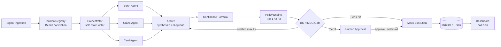

# Portwatch — Architecture Walkthrough

**AI-powered disruption orchestration for Tuas Port**
PSA Code Sprint · 4 people · 6-day build

Operational disruptions cascade across berth, crane, yard, and AGV systems that no single system sees end to end. Portwatch is a multi-agent orchestration layer that detects, correlates, analyses and responds to cross-system incidents — auto-executing what's safe, escalating what isn't, and leaving a complete auditable trace of every decision.

---

## 1. Design Paradigm

**One incident, one pipeline, one writer.**

Every incident runs as an isolated task that owns exactly one mutable record. Specialist agents and the arbiter *recommend*; only non-LLM code — the policy engine, the DG gate, the kill switch — *decides* what executes. That split is the direct answer to the "black-box AI" objection: nothing autonomous ever touches a system of record.



---

## 2. Key Architecture Decisions

The calls that would let four independently-built pieces diverge — fixed once, here, so nobody re-decides them mid-build.

### Paradigm & boundaries

**AD-1 — Single-process modular monolith**
One FastAPI process. All four build lanes live as modules within it — no microservices, no queues, no containers.
*Prevents:* infra complexity eating a 6-day budget.

**AD-2 — Direct Messages API, not Agent SDK**
Specialist agents, arbiter, and the status-query handler call the raw Anthropic Messages API. Agent SDK, Tool Runner, and Managed Agents are ruled out — their autonomy surface is exactly what least-privilege scoping needs to avoid.
*Prevents:* an agent inheriting reach beyond its role.

**AD-3 — Tool scoping at the call boundary**
Each agent's tool manifest is static config. Berth's manifest cannot contain the Yard Manager schema — the model can't call what it was never given.
*Prevents:* cross-domain tool calls by construction, not prompting.

### State & data ownership

**AD-4 — Single-writer orchestrator**
One `Incident` record per incident, held by its orchestrator task, with an embedded append-only trace. Only the orchestrator writes. Everything else calls and returns.
*Prevents:* concurrent incidents racing on shared state.

**AD-5 — Central correlation registry**
Every signal checks the `IncidentRegistry` (keyed by vessel/berth/crane/yard-block) before dispatch. A match within the 15-minute window joins the existing incident.
*Prevents:* duplicate incidents for one correlated event.

**AD-6 — Polling, not push**
Dashboard polls one read-only Incident endpoint every 2-3s. No SSE/WebSocket — indistinguishable from real-time against a ~20-30s golden path.
*Prevents:* a second, divergent read path.

**AD-18 / AD-19 — The "whole orchestra" is a read-only projection**
The Harbor Signal console (UX pivot, 2026-08-29 — visual identity now follows `frontend/portwatch-tuas/src`) makes the full pipeline continuously visible: stage rail, agent roster, confidence breakdown, DG-gate state. All of it renders from the same `GET /incidents` poll — stage rail, tier, DG state, confidence, and impact need **zero** backend change (AD-18); the agent roster needs one small additive read-surface: the orchestrator exposes the already-computed specialist bundle as `Incident.agents` (AD-19). The frozen 3-specialist contract, the policy engine, the DG gate, and every frozen test are untouched.
*Prevents:* a visual redesign reopening the Day-3-frozen golden path.

### Safety & policy

**AD-7 — One kill switch, one gate**
Single global flag, checked at exactly one point — immediately before any mock-service execution. Not checked upstream.
*Prevents:* inconsistent enforcement across code paths.

**AD-8 — DG/IMDG gate, fixed position**
Runs after policy-tier classification, before execution, independent of tier. Conflict loops back to the arbiter — capped at 2 re-plans, then forced Tier 3.
*Prevents:* a DG violation slipping through an approved tier.

**AD-14 — Failure is never silent success**
Every stage transition writes a trace entry regardless of outcome. A failed verification degrades confidence — it never crashes the task or gets swallowed.
*Prevents:* a masked failure reading as a clean incident.

**AD-15 — Kill-switch-blocked Tier 1/2 is marked, not dropped**
If the kill switch is engaged when a Tier 1/2 decision reaches the execution gate, the orchestrator writes a `blocked_by_kill_switch` trace entry and sets the matching `Incident` field — the tier is never silently reclassified. Re-enabling doesn't auto-resume; the operator re-triggers via the existing approve action.
*Prevents:* a Tier 1/2 incident sitting invisibly unresolved while the switch is engaged.

**AD-16 — Per-agent demo-safety mock override**
A static `MOCK_AGENTS` map lets the operator take one misbehaving specialist (or the arbiter) out of the live-LLM path before a demo run, returning a structurally-identical canned response. Honesty requirement: the trace marks it `mock_forced: true` and confidence takes the same missing-data penalty as a fallback — never an invisible substitution.
*Prevents:* one live-LLM hiccup during judging cascading into a stalled golden path.

### Demo & scale

**AD-11 — "Modify" = pick an alternative**
Tier-3 modify scopes to `select_alternative(option_id)` against the arbiter's existing 2-3 options — not free-form editing.
*Prevents:* building a generic plan-editor nobody needs for the demo.

**AD-13 — Latency budget shapes fan-out**
Specialist calls run concurrently via `asyncio.gather`, never sequentially. FR5's single retry has a short fixed timeout so one stalled call can't burn the whole ~20-30s budget.
*Prevents:* a sequential default silently blowing the demo timing.

**AD-12 — Two-block yard model, day one**
Yard Manager returns per-block utilization (Tuas C7, Pasir Panjang P2) from the start, even though FR17 routing is Day-5 stretch.
*Prevents:* a schema change under Day-5 time pressure.

### Map & visibility

**AD-17 — Map surface is a bundled, read-only projection**
The geographic map panel renders from the same `GET /incidents` poll — no new endpoint, no SSE. Basemap geometry is vendored into the frontend bundle; zero runtime calls to any tile service. Entity → coordinate is a static frontend fixture. The map is not a decision surface.
*Prevents:* a live tile dependency becoming a demo failure point; the map becoming a second source of incident truth.

---

## 3. How the Architecture Answers the Judging Criteria

| Criterion | Where the architecture answers it |
| --- | --- |
| **Agentic AI Design & Technical Execution** | Fan-out/fan-in multi-agent analysis (AD-2, AD-13), deterministic policy engine outside LLM authority (paradigm), full execution trace (AD-4, AD-14). |
| **Innovation & Originality** | Correlates cross-system signals no single PSA system owns; tiered autonomy (Tier 1/2/3) lets most incidents resolve invisibly while surfacing only what needs a human. |
| **Scalability & Responsible AI** | Stateless-per-incident actors prove concurrency live (AD-1, AD-4); FR17 / FR19 extend the same Yard Agent, policy engine, and mock-call contract unchanged (AD-12) — proven by the concurrency + extensibility **test suite** (257 backend tests), described as designed-and-proven integration points rather than live pipeline behaviour; Future Extensions named as roadmap, never demoed as working. |
| **Presentation & Clarity** | This walkthrough + the execution-trace example below — the same document serves the team build and the judge explanation. |

---

## 4. Security, Safety, Scalability

| Concern | Position |
| --- | --- |
| Kill switch | Global flag, single enforcement point pre-execution (AD-7). Instant. |
| Policy authority | Tier engine, DG gate, and confidence formula are plain deterministic functions — no LLM in the decision path. |
| Least privilege | Static per-agent tool manifests (AD-3); Berth cannot reach the Yard Manager. |
| API authentication | The console API is **unauthenticated by design for the demo** — single trusted operator, internal network, mock-only downstream services, no real actuation. Production sits behind the terminal's SSO / reverse-proxy with per-operator identity, RBAC on the `/approval` and `/kill-switch` routes, and request rate limiting. This is an edge concern: no domain-logic change, the pipeline is untouched. The one real secret (`ANTHROPIC_API_KEY`) is read from the environment and never logged or returned. |
| DG/IMDG compliance | Simplified, representative ruleset built for demo purposes (PRD §6) — explicitly **not** a certified compliance implementation. The gate mechanism (hard, tier-independent, bounded re-plan) is production-shaped; the ruleset behind it would be replaced by the certified IMDG segregation matrix. |
| Map data provenance | The geographic map is an **illustrative projection of mock incident state** (PRD §6a, AD-17): bundled basemap geometry, static entity→coordinate fixtures, zero runtime network calls, updated from the same `GET /incidents` poll as the rest of the console. It is explicitly **not** an AIS/VTS feed and carries no vessel-tracking claim — "Strait-Level Multi-Vessel Collision Avoidance" stays vision-only in Future Extensions, never demoed. |
| Concurrency proof | ≥2 incidents resolved concurrently via stateless-per-incident tasks (AD-1, AD-4), asserted at the orchestrator layer by 4 deterministic isolation tests + an `asyncio.Barrier` simultaneity harness — genuinely non-vacuous, not wall-clock-dependent. |
| Demo mock overrides | Per-agent `MOCK_AGENTS` (AD-16) + recorded-backup run; a canned response is always trace-marked and confidence-penalised, never passed off as real. |
| Approval-bottleneck-at-scale | Named, not built (PRD §7). Many Tier-3 escalations during one large event would queue behind a single operator. Future answer: prioritize escalations by predicted-impact / SLA-risk score, batch by shared root cause. Stateless-per-incident design means this is a scheduling layer on top, not a re-architecture. |

---

## 5. Audit Trail in Practice — UJ-1 Walked Through the Trace

Priya, Ops Duty Manager: a vessel ETA slip and a crane fault correlate into one incident. A telemetry timeout drops confidence mid-analysis — logged, not hidden — and a DG conflict forces one re-plan before the approval card ever reaches her.

```text
t+0.0s   INGEST           vessel:MSC-ANNA ETA +90min · crane:C4 hydraulic_fault
t+0.4s   CORRELATE        shared entity berth:C7-3, within 15-min window -> INC-0417
t+1.2s   AGENT_CALL       berth · crane · yard agents dispatched concurrently
t+6.8s   AGENT_CALL       crane:C7 telemetry timeout -> retry(1) -> fallback to last-known state
t+9.1s   SYNTHESIZE       arbiter returns 3 ranked options, recommends Option B
t+9.2s   CONFIDENCE       100 -> 91 (staleness) -> 67 (missing-data, fallback penalty logged)
t+9.4s   POLICY_DECISION  Option B classified TIER 3 -- confidence < 70, SLA risk
t+9.5s   DG_CHECK         Option B rejected -- DG segregation conflict -> re-plan (1/2)
t+14.0s  SYNTHESIZE       arbiter re-plans -> Option B', DG-clear
t+14.2s  POLICY_DECISION  Option B' classified TIER 3 -- SLA breach risk persists
t+14.3s  APPROVAL         decision card presented to Priya -- situation, recommendation, confidence 67, 2 alternatives
t+58.1s  APPROVAL         approve(Option B') -- human decision logged
t+58.4s  EXECUTE          4 mock services called: Crane Scheduler, Yard Manager, Notification (incl. MPA), TOS
t+61.9s  VERIFY           4/4 actions verified · incident closed
```

---

## 6. Build Map — Who Owns What

Four lanes, one shared contract — the ADs above are exactly the seams between these.

**Person A — Orchestration core**
Specialist agents, arbiter · Policy engine, confidence, DG gate
Owns AD-2, AD-3, AD-4, AD-8, AD-13, AD-14

**Person B — Mock services**
TOS, Crane Scheduler, Yard Manager (2-block), AGV, Gate, Notification (+MPA), DG Checker · Injectable timeout/failure modes
Owns AD-12, mock call contract

**Person C — Frontend** (Harbor Signal re-skin)
Incident feed · decision card · execution trace · stage rail · agent roster (new) · geo map · Ask Portwatch · kill switch
Owns AD-6, AD-11, AD-17, AD-18 client side · consumes `Incident.agents` (AD-19)

**Person D — Integration & demo**
Wires A + B + C together · Kill switch, demo scripting
Owns AD-1, AD-7

---

## 7. Stack & Deferred

| Layer | Choice |
| --- | --- |
| Backend | Python 3.12+ · FastAPI ~0.141.x |
| Agent calls | Anthropic Messages API · claude-sonnet-5 |
| Frontend | React 19.2.8 · TypeScript · Vite 8.1.3 |
| Persistence | In-memory only — no database |
| Auth | None — single-user demo |

**Deferred, with reason:**

- Production deployment/infra — not needed for a 6-day demo.
- Approval-bottleneck-at-scale — named future work, not built.
- Real PSA integrations — mocked services only.
- Certified DG/legal compliance — simplified ruleset, stated explicitly.
- **FR20 (AGV/Gate specialist) + FR18 (weather circuit-breaker) — descoped 2026-08-29** (`sprint-change-proposal-2026-08-29.md`): both need a 4th roster entry, which cannot be added without unfreezing the Day-3-frozen `SpecialistBundle`/arbiter contract. Lowest-ranked Day-5 stretch items; conditional-4th-specialist design preserved in `deferred-work.md`.
- Weather/micro-climate events beyond FR18 — same mock-service pattern, cheap-if-spare-time, not committed.
- Strait collision avoidance, transshipment MARL/GNN — roadmap only, never claimed as working.

---

*Generated from `ARCHITECTURE-SPINE.md` · Portwatch · PSA Code Sprint 2026-08-24 · sources: `prd.md`, `ARCHITECTURE-SPINE.md`*
