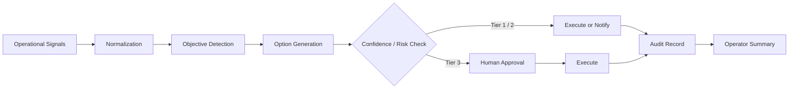

# Portwatch-Tuas Architecture Spine

## 1. System paradigm

The product is a human-in-the-loop port operations control plane for disruption triage. It does not attempt full autonomous control of live terminal systems. Instead, it continuously ingests operational signals, identifies the likely objective, recommends ranked actions with confidence and trade-offs, triggers approval when risk or ambiguity warrants it, and records the entire decision trail for auditability.

### Paradigm statement

- Primary job: detect and explain operational risk
- Decision style: bounded autonomy with visible policy boundaries
- Trust model: operator keeps authority for high-risk or ambiguous actions
- Success condition: faster, more consistent disruption response with clear accountability

## 2. Architectural invariants

### AD-01: Human-in-the-loop authority boundary
Binds: all actions with safety, service, or materially disruptive impact.
Prevents: silent autonomous execution on high-risk operations.
Rule: Tier 1 actions may execute only within pre-authorized and reversible safety bands; Tier 2 actions are executed with visible notification; Tier 3 actions require explicit human approval before execution.

### AD-02: Single source of truth for each disruption
Binds: objective, evidence, options, confidence, approval status, and outcome.
Prevents: fragmented state across map, logs, and approval surfaces.
Rule: every disruption record is created once and passed between UI, orchestration, and audit layers as a single decision object.

### AD-03: Explainability as a first-class interface contract
Binds: user-visible recommendations and policy rationale.
Prevents: black-box operation or unexplained auto-actions.
Rule: every recommendation must show objective, confidence, trade-offs, missing-data warnings, and a plain-language summary.

### AD-04: Boundary separation between event intake and operational policy
Binds: ingestion, normalization, and decision logic.
Prevents: UI logic owning operational policy or policy logic leaking into presentation.
Rule: event inputs are normalized into a shared schema before objective detection and recommendation logic runs.

### AD-05: Tool orchestration is explicit and sequential
Binds: multi-system coordination (scheduler, yard, berth, staffing, alerts).
Prevents: random or hidden tool calls and impossible action ordering.
Rule: recommended actions are modeled as an ordered workflow with explicit dependencies, not an isolated one-step suggestion.

### AD-06: Failure handling degrades gracefully
Binds: missing data, tool timeout, partial telemetry, or failed action.
Prevents: hard failure that hides the decision path.
Rule: when confidence is low or the tool path fails, the system surfaces the gap, presents a fallback or escalation, and records the outcome in the audit trail.

### AD-07: Audit trail is a required output, not an optional log
Binds: post-action review and accountability.
Prevents: unverifiable incident handling and weak operator trust.
Rule: every action record captures time, trigger, objective, options evaluated, decision, confidence, approvals, and final status.

### AD-08: Frontend remains a thin operational surface over a clear backend orchestration contract
Binds: client-server collaboration.
Prevents: duplicated logic and UI-only decision paths.
Rule: the app presents operational state, but the orchestration layer owns decision sequencing and state transitions for recommendations and execution.

## 3. System boundaries

### 3.1 Client boundary
Responsible for:
- dashboard layout and operator views
- live incident inbox and disruption cards
- map, fleet, and vessel status presentation
- approval interaction and human confirmation actions
- audit timeline rendering

Owns: UI readability, state display, and signal semantics.

### 3.2 Orchestration layer
Responsible for:
- normalizing events into a standard disruption record
- inferring objective from operational context
- generating ranked options with confidence and risk
- checking whether a recommendation triggers approval or escalation
- sequencing workflows and recording execution results

Owns: the decision flow and policy gating.

### 3.3 Shared domain model
Responsible for:
- event schema
- approval tiers
- objective definitions
- option types
- status and audit contracts

Owns: shared semantics across server and client.

## 4. Runtime model

## 5. Core data model

### Disruption record

- id
- sourceEvent
- timestamp
- operationalDomain (berth / yard / weather / equipment / staffing)
- objective
- evidence[]
- constraints[]
- options[]
- confidence
- approvalTier
- approvalState
- executionStatus
- auditTrail[]

### Option model

- id
- label
- impact
- confidence
- riskLevel
- tradeOffs[]
- assumptions[]
- requiredApprovalTier
- executionPlan[]

### Audit event model

- timestamp
- eventType
- summary
- actor
- status
- hashOrReference

## 6. Decision flow

1. Receive event intake from ops signals, alerts, weather, and schedule changes.
2. Normalize event metadata and attach relevant context.
3. Infer the objective and likely issue from the event set.
4. Rank candidate actions with confidence, risk, and trade-offs.
5. Evaluate escalation requirement based on tier and data quality.
6. Route high-risk actions to explicit operator approval.
7. Execute or recommend the selected sequence.
8. Emit a final audit record and operator summary.

## 7. Technical stack and fit

### Frontend
- React + TypeScript + Vite
- Existing app scaffold already matches the operational dashboard use case
- UI responsibilities remain presentation and interaction only

### Backend
- Express server entry in server/index.ts
- Lightweight orchestration API suitable for demo simulation and local decision flow

### Shared layer
- shared constants and type contracts for domain objects
- avoids drifting definitions between client and server

### Why this fits

The project already shows a crisp front-end harness and a simple server boundary, which is enough for a sprint prototype. The architecture therefore keeps the solution lightweight, explainable, and coherent without inventing a large enterprise platform.

## 8. Environment, operations, and deployment assumptions

### Deployment model
Single-process demo deployment: local Vite client + Express server, served from the same project during the sprint.

### Environments
- local development for interactive demo and operator flows
- production-like preview for final showcase

### Observability
- visible status indicators in the UI
- execution timeline for action outcomes
- confidence and risk labels in every recommendation

## 9. Deferred decisions

- Full enterprise system integration with all PSA systems is deferred.
- Autonomous execution across critical equipment is deferred until policy and operator controls are fully modeled.
- Complex multi-tenant role management is deferred beyond the MVP.
- Real external sensor APIs are treated as demo inputs rather than a full production integration contract.

## 10. Recommended MVP slice

The initial implementation should focus on a single disruption path:
- berth or yard disruption event arrives
- objective is inferred and explained
- three ranked options are generated
- one option requires human approval
- execution trace and summary are visible

This aligns with the PRD and keeps the prototype understandable in a 12-hour hackathon window.

## 11. Acceptance boundaries

The architecture is valid if it keeps these invariants intact:
- no high-risk action executes silently
- every recommendation is explainable
- operator approval is explicit when required
- the decision trail is complete enough to support review
- the app remains understandable to a non-technical operations audience
